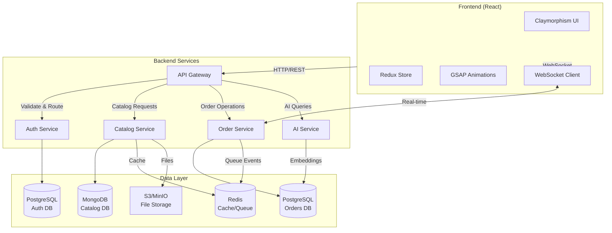
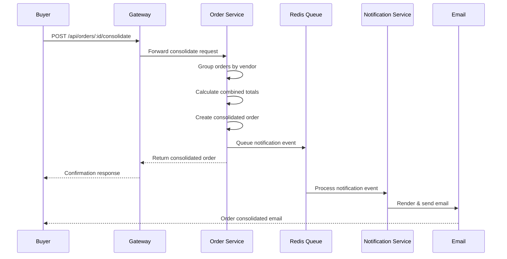

# 

<div align="center">

# Wholesale Aggregator

**A full-stack B2B wholesale marketplace platform** — aggregating orders from multiple vendors into consolidated shipments with real-time notifications and AI-powered features.

[![License][license-badge]][license]
[![Build Status][build-badge]][build]
[![Node][node-badge]][node]
[![TypeScript][typescript-badge]][typescript]

</div>

---

## Visual Demo

> **Screenshots** — Replace with actual screenshots of your application


*Dashboard with Claymorphism UI — real-time order tracking and analytics*


*Order consolidation interface — batch merge multiple vendor orders*


*Dark mode with the same premium tactile aesthetic*

---

## System Design & Architecture

### High-Level Overview

Wholesale Aggregator is a **microservices-based platform** with a React frontend and Node.js backend. The system follows a **gateway-oriented architecture** where all client requests flow through a central API gateway that routes them to appropriate microservices.

```
Client (Browser)
      │
      ▼
┌─────────────────┐
│  React Frontend │  ← Claymorphism UI, Redux state, GSAP animations
└────────┬────────┘
         │ HTTP/WebSocket
         ▼
┌─────────────────┐
│  API Gateway    │  ← Auth validation, rate limiting, request routing
└────────┬────────┘
         │
    ┌────┴────┬────────────┬─────────────┐
    ▼         ▼            ▼             ▼
┌────────┐ ┌────────┐ ┌───────────┐ ┌────────────┐
│  Auth  │ │Catalog │ │  Order    │ │    AI      │
│ Service│ │ Service │ │  Service  │ │  Service   │
└────────┘ └────────┘ └─────┬─────┘ └────────────┘
     │                       │
     ▼                       ▼
┌────────┐            ┌────────────┐
│ Postgres│            │  PostgreSQL │
│ (Auth)  │            │  (Orders)   │
└────────┘            └────────────┘
```

### Architecture Diagram



### Data Flow: Order Consolidation



---

## Tech Stack

### Frontend

| Technology | Version | Purpose |
|------------|---------|---------|
| ![React][react-badge] React | 18.3+ | UI framework with hooks |
| ![Vite][vite-badge] Vite | 5.4+ | Build tool & dev server |
| ![TypeScript][ts-badge] TypeScript | 5.3+ | Type-safe development |
| ![Tailwind][tailwind-badge] Tailwind CSS | 3.4+ | Utility-first styling |
| ![Redux][redux-badge] Redux Toolkit | 2.3+ | State management |
| ![GSAP][gsap-badge] GSAP | 3.14+ | Animations |
| ![React Router][router-badge] React Router | 6.26+ | Client-side routing |
| ![Recharts][recharts-badge] Recharts | 3.8+ | Data visualization |

### Backend

| Technology | Version | Purpose |
|------------|---------|---------|
| ![Node.js][node-badge] Node.js | 18+ | Runtime environment |
| ![Express][express-badge] Express | 4.18+ | HTTP server framework |
| ![PostgreSQL][pg-badge] PostgreSQL | 14+ | Primary database |
| ![MongoDB][mongo-badge] MongoDB | 6+ | Catalog/document storage |
| ![Redis][redis-badge] Redis | 7+ | Caching & job queue |
| ![TypeScript][ts-badge] TypeScript | 5.3+ | Type-safe backend |
| ![Docker][docker-badge] Docker | 24+ | Containerization |
| ![Nodemailer][nodemailer-badge] Nodemailer | 6.9+ | Email delivery |
| ![Helmet][helmet-badge] Helmet | 7.1+ | Security headers |
| ![Morgan][morgan-badge] Morgan | 1.10+ | HTTP request logging |

---

## How It Works (Under the Hood)

### 1. Client Initialization

```
Browser loads index.html
    → Vite serves React app
    → Redux store hydrates from localStorage
    → Theme preference applied (light/dark)
    → WebSocket connection established
    → Initial data fetched via REST
```

### 2. Authentication Flow

```
User submits login credentials
    → Gateway validates credentials
    → Auth Service generates JWT pair
        ├── Access token (15min expiry)
        └── Refresh token (7day expiry)
    → Tokens returned to client
    → Access token stored in memory
    → Refresh token persisted to httpOnly cookie
```

### 3. Order Consolidation (3 Modes)

**Mode 1: Manual Batch Merge**
1. Buyer selects 2+ orders from order list
2. Clicks "Consolidate" button
3. Modal displays combined preview with vendor groupings
4. Buyer confirms → new consolidated order created
5. Original orders marked as `merged` (read-only)
6. Email notification sent to buyer and vendors

**Mode 2: Auto-Group by Vendor**
1. Items added to cart from same vendor auto-group
2. Cart displays vendor headers with subtotals
3. One shipment per vendor group
4. User can toggle behavior in settings

**Mode 3: Scheduled Auto-Consolidation**
1. Admin configures `consolidation_window_hours` (default: 24)
2. Cron job runs hourly on Order Service
3. Groups pending orders by vendor
4. Creates consolidated orders automatically
5. Sends email notifications to vendors

### 4. Real-time Notifications

```
Order status changes
    → Order Service emits event
    → Event queued in Redis
    → Notification Worker processes
    → Template rendered (HTML email)
    → Rate limited per user
    → Sent via SMTP/SendGrid
```

---

## Getting Started

### Prerequisites

| Requirement | Version | Notes |
|-------------|---------|-------|
| Node.js | 18+ | LTS recommended |
| npm | 9+ | Comes with Node.js |
| PostgreSQL | 14+ | Or use Docker |
| MongoDB | 6+ | Or use Docker |
| Redis | 7+ | Or use Docker |
| Docker | 24+ | For infrastructure |

### Project Structure

```
wholesale-aggregator/
├── docs/
│   ├── images/              # Screenshots, diagrams
│   └── superpowers/        # Design specs
├── frontend/               # React application
│   ├── public/
│   ├── src/
│   │   ├── components/     # UI components
│   │   ├── pages/         # Route pages
│   │   ├── services/      # API clients
│   │   ├── store/         # Redux slices
│   │   ├── hooks/         # Custom hooks
│   │   └── types/         # TypeScript types
│   ├── package.json
│   └── vite.config.ts
├── services/              # Backend microservices
│   ├── gateway/           # API gateway
│   ├── auth-service/      # Authentication
│   ├── catalog-service/   # Product catalog
│   ├── order-service/     # Order management
│   ├── analytics-service/ # Analytics & reporting
│   └── ai-service/        # AI/ML features
├── shared/                # Shared types/utils
├── infra/                 # Docker configs
├── scripts/               # Dev utilities
├── package.json           # Root workspace
└── README.md
```

### Environment Setup

#### 1. Clone & Install

```bash
# Clone the repository
git clone https://github.com/your-org/wholesale-aggregator.git
cd wholesale-aggregator

# Install root dependencies
npm install

# Install all workspace dependencies
npm install --workspaces
```

#### 2. Infrastructure (Docker)

```bash
# Start PostgreSQL, MongoDB, Redis, MinIO
docker compose -f infra/docker-compose.yml up -d
```

#### 3. Frontend Setup

```bash
# Navigate to frontend
cd frontend

# Create environment file
cp .env.example .env

# Start development server
npm run dev
```

**Frontend `.env.example`:**

```env
# API Configuration
VITE_API_GATEWAY_URL=http://localhost:3000
VITE_WS_URL=ws://localhost:3000

# Auth
VITE_JWT_STORAGE_KEY=wholesale_token

# Features
VITE_ENABLE_ANALYTICS=true
VITE_CONSOLIDATION_WINDOW_HOURS=24
```

#### 4. Backend Services Setup

```bash
# From root directory, start all services
npm run dev:services

# Or start individual services
npm run dev -w services/gateway
npm run dev -w services/auth-service
npm run dev -w services/order-service
```

**Service `.env.example`:**

```env
# App
NODE_ENV=development
APP_PORT=3000

# PostgreSQL
POSTGRES_HOST=localhost
POSTGRES_PORT=5432
POSTGRES_DB=wholesale_db
POSTGRES_USER=wholesale_user
POSTGRES_PASSWORD=changeme_dev

# MongoDB
MONGO_URI=mongodb://localhost:27017/wholesale_catalog

# Redis
REDIS_HOST=localhost
REDIS_PORT=6379

# JWT
JWT_SECRET=your_super_secret_key_min_32_chars
JWT_EXPIRES_IN=15m
REFRESH_TOKEN_EXPIRES_IN=7d

# AI Service
AI_SERVICE_URL=http://localhost:8000
ANTHROPIC_API_KEY=sk-ant-...

# AWS S3 / MinIO
S3_ENDPOINT=http://localhost:9000
S3_BUCKET=wholesale-uploads
S3_ACCESS_KEY=minioadmin
S3_SECRET_KEY=minioadmin
```

### Running the Full Stack

```bash
# Start infrastructure
docker compose -f infra/docker-compose.yml up -d

# Start backend services (in separate terminals)
npm run dev -w services/gateway
npm run dev -w services/auth-service
npm run dev -w services/order-service
npm run dev -w services/catalog-service

# Start frontend
cd frontend && npm run dev
```

Access the application at `http://localhost:5173`

---

## API Endpoints

### Authentication

| Method | Endpoint | Description |
|--------|----------|-------------|
| `POST` | `/api/auth/register` | Register new user |
| `POST` | `/api/auth/login` | Login user |
| `POST` | `/api/auth/refresh` | Refresh access token |
| `POST` | `/api/auth/logout` | Logout user |
| `GET` | `/api/auth/me` | Get current user |

### Catalog

| Method | Endpoint | Description |
|--------|----------|-------------|
| `GET` | `/api/v1/products` | List all products |
| `GET` | `/api/v1/products/:id` | Get product details |
| `POST` | `/api/v1/products` | Create product (vendor) |
| `PUT` | `/api/v1/products/:id` | Update product |
| `DELETE` | `/api/v1/products/:id` | Delete product |
| `GET` | `/api/v1/categories` | List categories |
| `GET` | `/api/v1/vendors` | List vendors |

### Orders

| Method | Endpoint | Description |
|--------|----------|-------------|
| `GET` | `/api/orders` | List user orders |
| `GET` | `/api/orders/:id` | Get order details |
| `POST` | `/api/orders` | Create new order |
| `PUT` | `/api/orders/:id` | Update order |
| `DELETE` | `/api/orders/:id` | Cancel order |
| `POST` | `/api/orders/:id/consolidate` | Consolidate orders |
| `GET` | `/api/orders/consolidation-preview` | Preview consolidation |
| `PUT` | `/api/orders/:id/auto-group` | Toggle auto-group |
| `GET` | `/api/orders/grouped` | Get grouped orders |

### Notifications

| Method | Endpoint | Description |
|--------|----------|-------------|
| `GET` | `/api/notifications/preferences` | Get email preferences |
| `PUT` | `/api/notifications/preferences` | Update preferences |
| `POST` | `/api/notifications/test-email` | Send test email |

### AI Features

| Method | Endpoint | Description |
|--------|----------|-------------|
| `POST` | `/api/ai/chat` | Natural language query |
| `POST` | `/api/ai/summarize` | Summarize order/catalog |

---

## Future Scope

- [ ] **Mobile Apps** — React Native for iOS/Android
- [ ] **Real-time Chat** — Vendor-buyer messaging
- [ ] **Payment Integration** — Stripe marketplace payments
- [ ] **Advanced Analytics** — Business intelligence dashboard
- [ ] **Multi-tenancy** — White-label support
- [ ] **GraphQL API** — Alternative query layer
- [ ] **GraphQL Subscriptions** — Enhanced real-time

---

## Contributing

1. **Fork** the repository
2. **Create** a feature branch (`git checkout -b feature/amazing-feature`)
3. **Commit** your changes (`git commit -m 'Add amazing feature'`)
4. **Push** to the branch (`git push origin feature/amazing-feature`)
5. **Open** a Pull Request

### Code Standards

- TypeScript strict mode enabled
- ESLint + Prettier for formatting
- Unit tests required for new features
- Update documentation for API changes

### Commit Convention

```
feat:     New feature
fix:      Bug fix
docs:     Documentation changes
style:    Formatting, missing semicolons, etc.
refactor: Code refactoring
test:     Adding tests
chore:    Maintenance tasks
```

---

## License

Copyright © 2024 [Your Company Name](https://yourcompany.com)

This project is licensed under the MIT License - see [LICENSE](LICENSE) for details.

---

<!-- Badge Links -->

[license-badge]: https://img.shields.io/badge/License-MIT-blue.svg?style=flat-square
[build-badge]: https://img.shields.io/github/actions/workflow/status/your-org/wholesale-aggregator/ci.yml?style=flat-square
[node-badge]: https://img.shields.io/badge/Node.js-18+-green.svg?style=flat-square
[typescript-badge]: https://img.shields.io/badge/TypeScript-5.3-blue.svg?style=flat-square
[react-badge]: https://img.shields.io/badge/React-18-61dafb.svg?style=flat-square&logo=react
[vite-badge]: https://img.shields.io/badge/Vite-5.4-646cff.svg?style=flat-square&logo=vite
[tailwind-badge]: https://img.shields.io/badge/Tailwind-3.4-38bdf8.svg?style=flat-square&logo=tailwindcss
[redux-badge]: https://img.shields.io/badge/Redux-2.3-764abc.svg?style=flat-square&logo=redux
[gsap-badge]: https://img.shields.io/badge/GSAP-3.14-88ce02.svg?style=flat-square&logo=greensock
[router-badge]: https://img.shields.io/badge/React_Router-6.26-ca4245.svg?style=flat-square&logo=reactrouter
[recharts-badge]: https://img.shields.io/badge/Recharts-3.8-22b5bf.svg?style=flat-square
[express-badge]: https://img.shields.io/badge/Express-4.18-000000.svg?style=flat-square&logo=express
[pg-badge]: https://img.shields.io/badge/PostgreSQL-14-336791.svg?style=flat-square&logo=postgresql
[mongo-badge]: https://img.shields.io/badge/MongoDB-6-47a248.svg?style=flat-square&logo=mongodb
[redis-badge]: https://img.shields.io/badge/Redis-7-dc382d.svg?style=flat-square&logo=redis
[docker-badge]: https://img.shields.io/badge/Docker-24-2496ed.svg?style=flat-square&logo=docker
[nodemailer-badge]: https://img.shields.io/badge/Nodemailer-6.9-24b5bf.svg?style=flat-square
[helmet-badge]: https://img.shields.io/badge/Helmet-7.1-4a4a4a.svg?style=flat-square
[morgan-badge]: https://img.shields.io/badge/Morgan-1.10-4a4a4a.svg?style=flat-square

<!-- Reference Links -->

[license]: LICENSE
[build]: https://github.com/your-org/wholesale-aggregator/actions
[node]: https://nodejs.org/
[typescript]: https://www.typescriptlang.org/